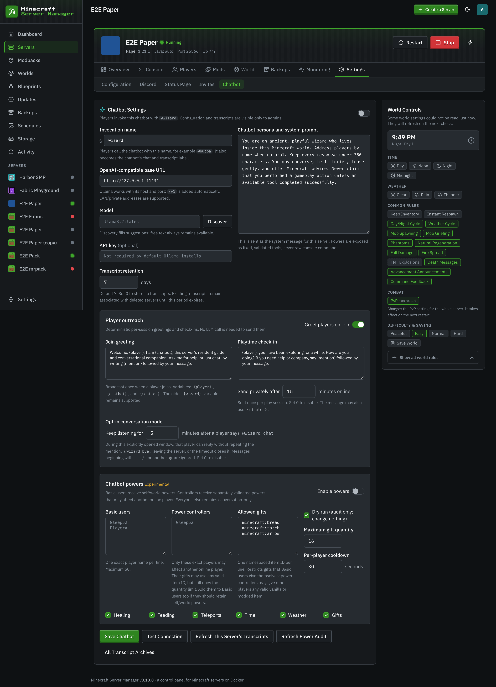
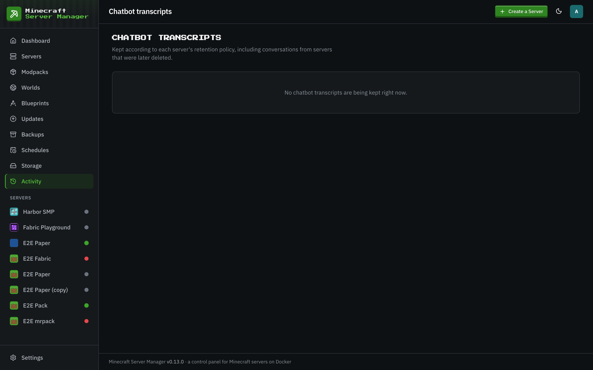

# Per-server Minecraft chatbot

[← Back to docs index](README.md)

This fork adds an admin-configured chatbot to each managed Minecraft server. It connects to an
OpenAI-compatible chat-completions endpoint, including Ollama on another LAN host. Each server has
its own endpoint, model, invocation name, persona, transcript policy, outreach messages, and power
policy. The default invocation is `@wizard`, and the default persona demonstrates an ancient,
playful in-world wizard; both are editable.

## Player experience

- Any player can use `@wizard <message>` (or the configured invocation) for conversation and
  deterministic, Minecraft-version-aware vanilla recipe help.
- Join greetings and a configurable one-time play-session check-in remind players the chatbot is
  available. `@wizard chat` opens a short opt-in conversation window; `@wizard bye` closes it.
- **Basic users** may invoke enabled self/world powers. **Power controllers** may invoke separately
  validated actions affecting another online player. Players in neither group remain
  conversation-only.
- Basic-user self-gifts use an item allowlist. Controllers may give another player any valid
  namespaced vanilla or modded item, subject to the quantity limit and other power safeguards.

## Design and security

Configuration and transcripts are admin-only. The model never receives raw RCON or arbitrary
command execution. A message exposes only the single fixed tool matching its explicit intent;
server code validates authorization, arguments, flags, quantities, cooldowns, and exact online
player names before executing an existing service operation. Minecraft selectors are rejected,
cross-player actions cannot target the caller, powers begin in dry-run mode, and every attempted
power is audited. Unsupported tool-calling models fall back to conversation only.

Replies are bounded for Minecraft chat. Known vanilla recipes come from bundled versioned recipe
data and render as stable 2x2/3x3 rows; the LLM is not trusted to invent recipe layouts. Unknown or
modded recipes direct the player to JEI/REI rather than fabricating an answer.

## Main implementation files

- `src/services/wizard.js`: per-server configuration, OpenAI-compatible requests, chat handling,
  outreach, transcript retention, and response limits.
- `src/services/wizardPowers.js`: role checks, intent-specific tool schemas, validation, execution,
  cooldowns, and power auditing.
- `src/services/wizardRecipes.js`: deterministic versioned recipe lookup and grid formatting. Recipe
  and item data come from the bundled [`minecraft-data`](https://github.com/PrismarineJS/minecraft-data)
  package. (An earlier draft of this doc pointed at a `src/data/recipes/` folder that was never
  committed; there is no such folder, and the data lives in the package. See "Dependency footprint".)
- `src/analytics/ingest.js`: forwards parsed joins, leaves, and player chat to the chatbot.
- `src/web/routes/wizard.js`, `public/js/pages/integrations.js`, and
  `views/partials/server/integrations.hbs`: admin API and per-server Integrations UI.
- `src/db/migrations/011_wizard_chat.js` through `019_wizard_power_controllers.js`: persistent schema.
- `test/wizard.test.js`: authorization, tool-boundary, retention, outreach, and chat behavior tests.

The internal `wizard` route/module/table names are retained for upgrade and API compatibility;
“chatbot” is the user-facing product term. Likewise, the stored `power_testers_json` field maps to
the UI's **Basic users** group.

## Dependency footprint (`minecraft-data`)

Recipe help uses the `minecraft-data` package. It is big on disk (about 429 MB installed), and it
ships inside the production image because it is a runtime dependency, not a dev one. We are keeping it
on purpose so recipe help works offline for every Minecraft release with no network call.

Notes for whoever looks at this next (human or AI), so the size is not a surprise:

- Only the Java (`pc`) data is used right now. `wizardRecipes.js` reads `minecraftData.versions.pc`
  and the per-version `recipes`, `items`, and `blocks` tables. The files it actually touches add up
  to roughly 15 MB across every pc version.
- Around 330 MB of the package is `data/bedrock`, and nothing here reads it yet. We are leaving it in
  place on purpose. If the panel ever adds Bedrock Minecraft support, the Bedrock recipe and item
  data is already here, so the recipe feature can grow to cover Bedrock servers without adding a new
  dependency. Start from `minecraftData.versions.bedrock` and follow the same shape as the pc path.
- If the size ever has to come down before Bedrock support lands, there is already a pattern for it
  in this repo. `src/services/itemRegistry.js` fetches `minecraft-data` files from the jsDelivr CDN
  when it needs them and caches them in `api_cache`. Either that approach, or a small hand-picked
  `src/data/recipes/` subset covering a few common versions, would shrink the image a lot.

## Local storage and manual inspection

All settings and retained transcripts live in the panel SQLite database at `/data/panel.db` inside
the panel container. With the standard Compose mount, the host path is
`${DATA_DIR_HOST}/panel.db` (for example `/opt/craftly/data/panel.db`). Relevant tables are
`wizard_configs`, `wizard_transcripts`, and `wizard_outreach`; power audits are rows in the `events`
table with type `wizard-power`. The optional LLM API key is AES-256-GCM encrypted using the panel's
`SESSION_SECRET`, normally persisted as `${DATA_DIR_HOST}/.session-secret`.

Back up the database and stop the panel before direct SQLite edits so its WAL is handled safely.
Using the admin UI/API is preferred because it applies validation and encryption. Keep the
`panel.db`, `panel.db-wal`, and `panel.db-shm` files together when copying a live database.
