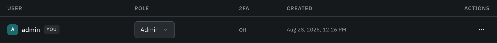
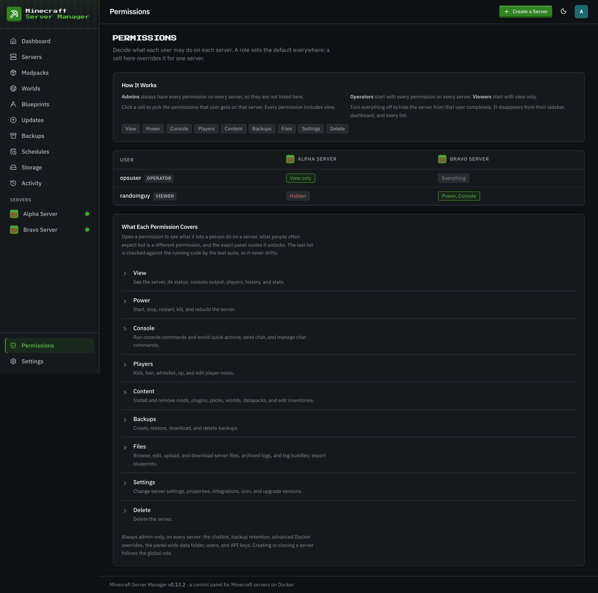
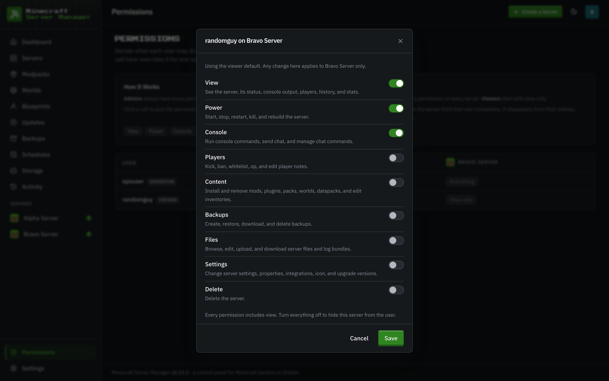
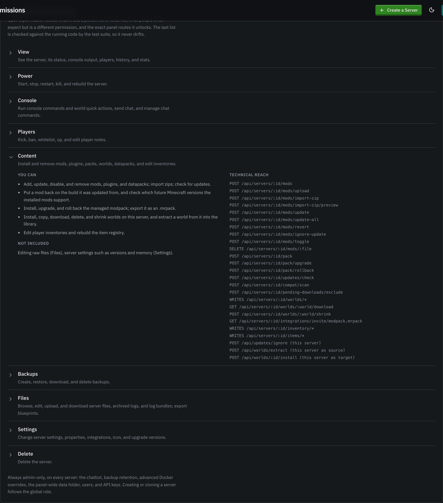
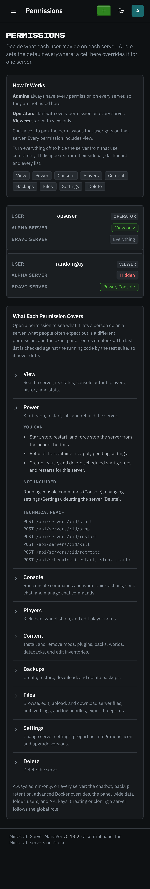
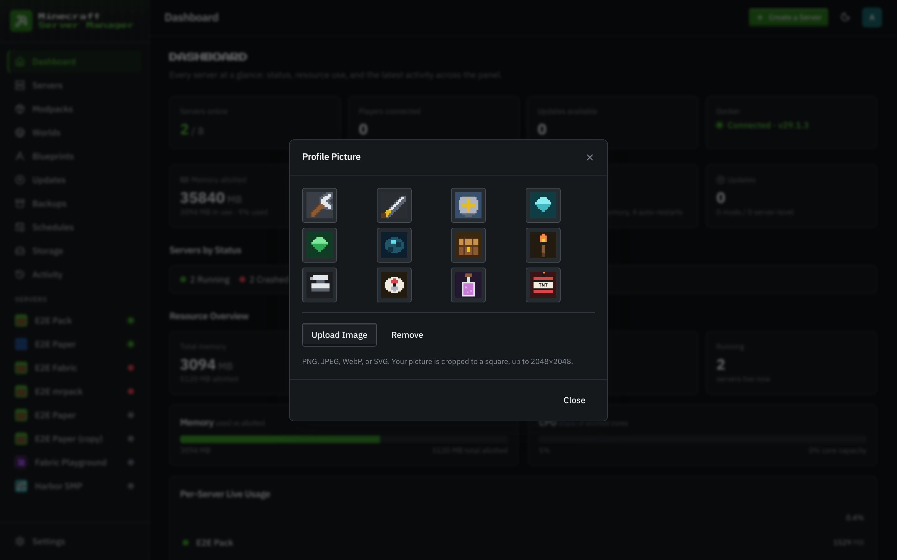

# Users & roles

[← Back to docs index](README.md)

The panel is multi-user. Manage accounts under **Settings → Users**.

## The three roles

| Role         | Default on every server                                                                                          |
| ------------ | ---------------------------------------------------------------------------------------------------------------- |
| **admin**    | Everything: manage users, API keys, global files, advanced Docker overrides, and every server action.            |
| **operator** | Run and configure servers (start/stop, console, backups, worlds, mods, most settings), but not admin-only areas. |
| **viewer**   | Read-only. See servers and their status, but make no changes.                                                    |

Every user, including a viewer, can manage their own [two-factor authentication](two-factor-authentication.md), because protecting your own login isn't a server-management action.

A role is the **default** for every server. To give someone different rights on one server, use per-server permissions below.

## Per-server permissions

**Settings → Permissions** shows a grid: every operator and viewer down the side, every server across the top. Click a cell to decide what that user may do on that one server. Admins are not listed because they always have everything.

Each cell is a set of permissions:

| Permission   | What it allows on that server                                                                       |
| ------------ | --------------------------------------------------------------------------------------------------- |
| **View**     | See the server, its status, console output, players, history, and stats.                            |
| **Power**    | Start, stop, restart, kill, and rebuild the server.                                                 |
| **Console**  | Run console commands and world quick actions, send chat, and manage chat commands.                  |
| **Players**  | Kick, ban, whitelist, op, and edit player notes.                                                    |
| **Content**  | Install and remove mods, plugins, packs, worlds, datapacks, and edit inventories.                   |
| **Backups**  | Create, restore, download, and delete backups.                                                      |
| **Files**    | Browse, edit, upload, and download server files, archived logs, and log bundles; export blueprints. |
| **Settings** | Change server settings, properties, integrations, icon, and upgrade versions.                       |
| **Delete**   | Delete the server.                                                                                  |

Below the grid, **What Each Permission Covers** opens each permission into what a person can do, what is not included, and the exact panel routes it unlocks. That last list is checked against the running code by the test suite.

On a phone the grid stacks into one card per user, with a row per server.

  

How the pieces fit together:

- **The role is the default.** An operator starts with every permission on every server; a viewer starts with View only. A cell that says "Role default" has never been changed.
- **A cell overrides the role for that server only.** Give a viewer Power and Console on one server and they can run it, while every other server stays read-only for them. Take Delete away from an operator on your main server and they keep everything else there.
- **Every permission includes View.** You cannot act on a server you cannot see.
- **Turn everything off to hide a server.** It disappears from that user's sidebar, dashboard, backups, schedules, activity, updates, modpacks, live status, running tasks, and blueprints, and the worlds library stops naming it. A direct link, API call, or console socket answers "not found", the same as a server that does not exist.
- **Panel-wide actions still follow the role.** Creating servers (including cloning one), storage, users, API keys, global settings, and panel-wide schedules are not per-server, so a viewer with permissions on some servers still cannot do any of those. Operators keep them.
- **Schedules follow the server.** A scheduled restart, backup, or command on a server needs the matching permission there (Power, Backups, or Console), whatever the role.
- **Blueprints follow the server too.** Exporting a server as a blueprint needs Files there, because the archive carries its files. A blueprint exported from a server someone cannot see is hidden from them as well.
- **Admin-only areas stay admin-only** on every server: the chatbot, backup retention, and advanced Docker overrides.

Every change is written to the activity log with who changed what; those entries are shown to admins only. Deleting a user removes their rows. Removing a server keeps them, so a server hidden from someone stays hidden in its history and kept backups.

Existing installations keep working unchanged: until an admin edits a cell, every user has exactly what their role gave them before.

## Admin-only, and why

A few things are restricted to admins on purpose:

- **User management, API keys, and global files.**
- **The [public API](public-api.md)** - enabling `/api/v1` and creating, scoping, or revoking its read-only Bearer tokens.
- **Advanced Docker overrides** - custom container name, extra port publishes, and bind mounts. A bind mount can map any host path into a container, and combined with the panel's Docker access that's effectively root on the host. These fields only appear for admins.

Custom container names also can't live in the panel's own `craftly-` namespace, so a hand-named container can never shadow another server's and misdirect a stop or command to the wrong instance.

## Managing accounts

Admins can create users, change roles, reset passwords, and delete accounts from the Users table. The **2FA** column shows whether each user has two-factor enabled; an admin can **reset** another user's 2FA (for the lost-phone-and-backup-codes case), but never disable their own without their password, which the self-service flow handles instead.

Failed logins are rate-limited per account (both a per-IP and an account-global counter) to slow down brute-force attempts, and the same limit covers the 2FA code step so a correct password can't reset the counter before code-guessing. In front of that sits a coarser per-client-IP request limiter on the login / 2FA / setup endpoints, tunable via `RATE_LIMIT_AUTH_PER_15MIN` (default 100; behind a reverse proxy, set `TRUST_PROXY` so it keys on the real client IP).
